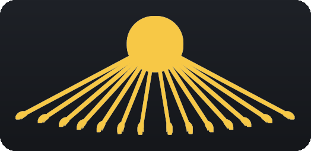
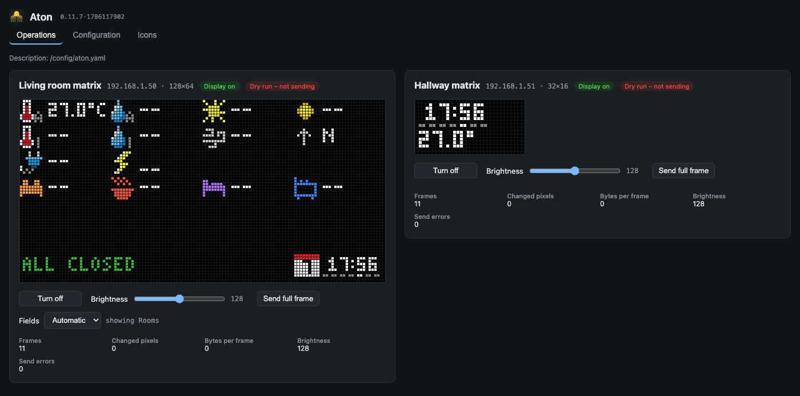

<!-- Als HTML, weil Markdown allein keine Bildhoehe kennt und das Logo sonst in
     voller Breite ueber der Seite laege. Die dunkle Platte ist im Bild mitgebacken,
     es traegt daher auf hellem wie dunklem GitHub-Thema. -->
<h1> Aton</h1>

A Home Assistant app (add-on) that renders LED matrix displays from a **YAML
description** and sends them to WLED.

What used to live in renderer code — tiles, positions, switching logic — lives in one
file instead, and the controls in Home Assistant are built from it automatically.

```
Panel (a display)
 └── Base image      what is always visible
 └── Screen groups   areas whose content changes
      └── Screens    each with a condition — or picked by hand in HA
           └── Pages a screen may cycle through several, at its own pace
```



## Documentation

| | |
|---|---|
| [Getting started](docs/getting-started.md) | From installing to the first picture on the matrix |
| [YAML reference](docs/yaml-reference.md) | Every key, with examples |
| [The configurator](docs/configurator.md) | Editing without touching the file |
| [`aton/DOCS.md`](aton/DOCS.md) | The same reference, shown inside Home Assistant |
| [`examples/aton.yaml`](examples/aton.yaml) | A complete, commented example to copy |

## Installation

Two parts that work independently: the **app** renders and sends, the **integration**
turns that into controls in Home Assistant.

**1. App** — in Home Assistant: **Settings → Add-ons → Add-on store → ⋮ →
Repositories**, add the URL of this repository, install "Aton" and start it. The first
start builds the image, which takes a few minutes.

[](https://my.home-assistant.io/redirect/supervisor_add_addon_repository/?repository_url=https%3A%2F%2Fgithub.com%2Fatlan%2Faton-app)

**2. Description** — put `aton.yaml` next to `configuration.yaml`; copy
[`examples/aton.yaml`](examples/aton.yaml) as a starting point.

**3. Integration** (optional but recommended) — in HACS add this repository as a
*custom repository* of type *Integration*, download "Aton", restart HA. The app then
announces itself: the integration shows up under **Settings → Devices & services** as
discovered, one click is enough. Host and port come with it.

[](https://my.home-assistant.io/redirect/hacs_repository/?owner=atlan&repository=aton-app&category=integration)

## What the app brings

- **Frame built in memory**, only changed pixels are transmitted, with a full frame at
  wide intervals as a recovery point. A WLED device that was wiped rebuilds itself.
- **Real pixel fonts** (Spleen 5x8/6x12/8x16, Terminus) through Pillow, plus a compact
  5x3 font as a BDF file.
- **Controls without wiring**: one selector `Automatic | <screen> | …` per screen group,
  plus diagnostic sensors, a full-frame button, a preview image and optionally a
  brightness slider — grouped under one device. Provided by the companion integration,
  **without MQTT**.
- **Live preview** in Home Assistant's sidebar — you see the picture without standing in
  the room.
- **A configurator** in the same place: a tree over the whole description, tiles you can
  click and drag on the preview, a form for every field. It keeps the comments in your
  YAML, writes a backup before every save and reloads by itself. English and German;
  another language is one JSON file.
- **A notification strip**: short text as a static bar, long text through WLED's own
  marquee.
- **Your own icons** as PNG in `/homeassistant/aton_icons`, your own fonts in
  `/homeassistant/aton_fonts`.

## Layout of this repository

```
aton/                 the app (add-on)
  panel/config.py     read and validate the YAML (errors carry the path in the file)
  panel/hass.py       state mirror over Home Assistant's WebSocket API
  panel/templates.py  Jinja against that mirror (a subset of HA's templating)
  panel/render.py     build the image — no networking, therefore testable
  panel/wled.py       transmission: difference, full-frame anchor, marquee segment
  panel/discovery.py  announce to the supervisor so HA finds the app
  panel/display.py    run one display: cycle, gate, screens, notifications
  panel/web.py        the UI (ingress) and the HTTP API for the integration
  tools/              build fonts, read the browser console

custom_components/aton/   the companion integration (HACS)
  brand/              icon and logo shown by Home Assistant (2026.3 and newer)
tests/                    what a silent bug would cost most — see below
docs/                     the documentation you are reading
```

## Tests

```bash
python3 -m pytest
```

The suite covers the places where a mistake stays invisible: parsing the description,
merging it back into the file without losing comments, page rotation, and the brightness
decision. Rendering and the WLED transport are deliberately left out — there you would be
testing your own mocks, and a rendering mistake is visible on the matrix within a second.
The reasoning is written down in [`tests/conftest.py`](tests/conftest.py).

## Credits

The logo shows **Aten**, the sun disc with rays ending in hands, after
[Aten.svg](https://commons.wikimedia.org/wiki/File:Aten.svg) by **AtonX** (2007;
revised by FDRMRZUSA, 2026), used under
[CC BY 2.5](https://creativecommons.org/licenses/by/2.5/).

Changes: recoloured, and the shape slightly thickened so the rays survive at the
40 px height Home Assistant renders the logo at.
