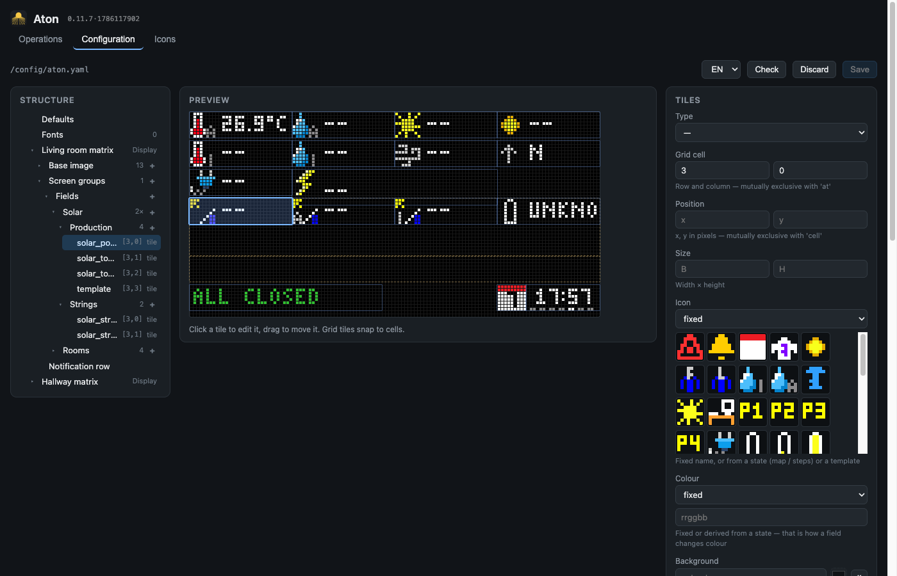

# The configurator

Everything the [YAML reference](yaml-reference.md) describes can be done in the browser
instead: **Aton → Configuration**.

It edits the same file you would edit by hand, and the two ways get along. Your comments
survive, and it refuses to save if the file changed underneath it in the meantime.



## Three areas

| | |
|---|---|
| **Structure** (left) | The whole tree: defaults, fonts, and per panel the base image, screen groups with their screens and pages, the notification row. Collapsible. |
| **Preview** (middle) | The computed picture. Tiles can be **clicked** and **dragged** — grid tiles snap to cells, absolutely placed ones move pixel by pixel. |
| **Form** (right) | Every field of the selected node, generated from the same schema the validation uses. |

In the screenshot the tree is fully open: the panel *Living room matrix*, its *Screen
groups*, the group *Fields*, the screen *Solar* — which carries `2×`, because it has two
pages — and inside it *Production* with its four tiles.

## Creating things

The `+` next to a branch in the tree: on *Base image* and on any screen for a tile, on
*Screen groups* for a group, on a group for a screen. The same buttons sit at the bottom
of the form. A new entry arrives with enough content to be visible immediately and to pass
validation; everything else is in the form. Reordering, duplicating and deleting are at
the bottom of the form as well.

**Another panel** comes from the `+ Panel` button — at the bottom of a panel's form, or
under *Defaults* (where it is reachable even when no panel exists yet). Size, grid and
interval are taken from the first existing panel; **`host` is deliberately left empty**,
because an invented address would send into the void without anyone noticing. Validation
rejects an empty required field, so fill in the IP of the second WLED device, then save.

## Moving things

Grab a tile on the preview and drag it. A grid tile snaps to cells and keeps its `cell`;
an absolutely placed one moves pixel by pixel and keeps its `at` — a `cell` never turns
into an `at` behind your back. A separate `text_at` travels with it.

Not only tiles: the **notification row** and the **region of a screen group** are drawn
dashed and yellow, and can be selected and dragged too (that moves `region`; width and
height stay). They sit behind the tiles, so a click hits the tile and only next to it the
region.

Which tiles are visible and clickable follows the selection: pick a screen in the tree and
the preview shows exactly that one — otherwise you would only ever see whichever screen is
currently due.

## Small things that save time

- Entities are suggested **with their current value**, so you do not type IDs from memory.
- Icons appear as a grid of pictures, not as a list of names.
- Icon and colour can be set in all four forms — fixed, `map`, `steps`, `template` —
  through the dropdown at the top of the field.

## Check, save, reload

**Check** reports errors with the path inside the file:

```
panels[0].widgets[3]: unknown keys: valu — allowed are: align, at, attribute, …
```

**Save** writes a backup first. Backups go to the subfolder **`aton_sicherungen/`** next
to the description — so that `/config` stays readable — and the last 20 are kept. Backups
from earlier versions are moved there on first start.

**Reload** re-reads the file and rebuilds fonts and icons along with it, so new files in
`aton_fonts` / `aton_icons` are available without restarting the app.

## Language

Top right. Another language is one JSON file in `www/i18n/`; German is the fallback, so a
missing translation shows the key.

## Two limits worth knowing

**`on` and `off` as keys** need quotes in `map:` — `map: {"off": dry, "on": wet}`.
Without them YAML 1.1 turns them into booleans, and the comparison against an entity state
(the string `"off"`) fails. The app reads the file in a way that keeps `on`/`off`/`yes`/`no`
as strings, but the quotes are still the clearer form, because other tools (your editor's
linter, `yamllint`) keep reading YAML 1.1.

**Comment preservation has an edge.** Comments attached to keys survive. A comment above a
**list item** hangs on its position — if something is inserted before it or the list is
reordered, the comment stays where it was. The first save also normalises indentation;
after that the file stays stable.

## The version marker

Next to the heading, every page shows the **build**: app version and modification time of
the UI, for example `0.10.5·1786111641`. If it does not match what you expect, your
browser is showing an old copy — reload hard (Ctrl-Shift-R, or Cmd-Shift-R). That is
faster to establish than hunting through the program.
